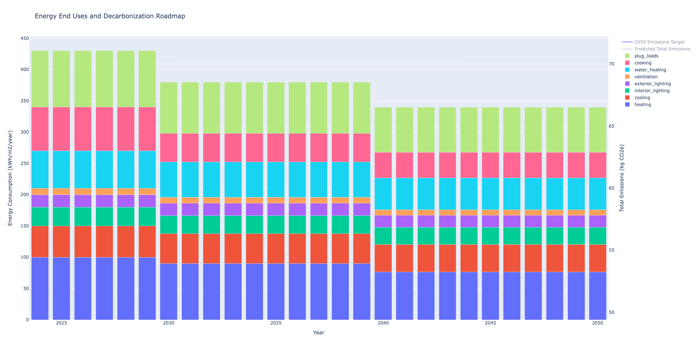
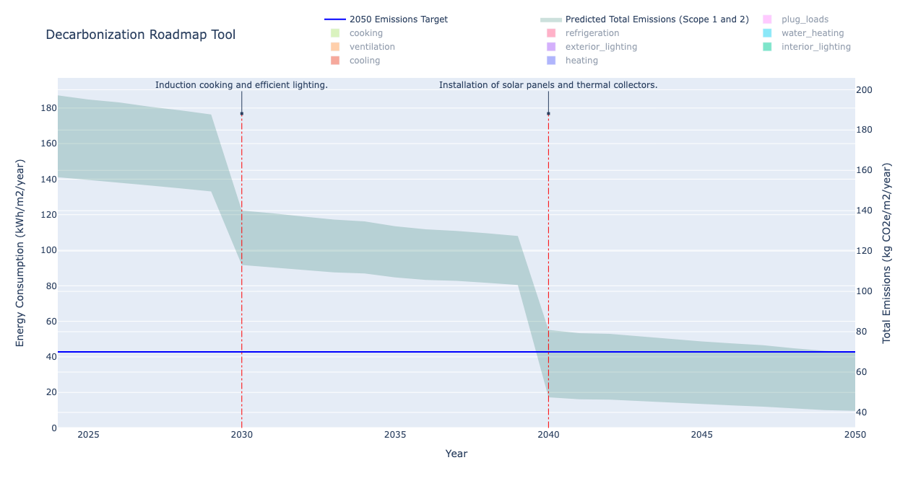

# Decarbonization Roadmap Script

This script employs Monte Carlo simulation to project carbon reductions for the future of a building asset, leveraging reliable data on energy end-use breakdowns and primary energy sources. Additionally, it utilizes estimations of energy reductions per end-use, typically sourced from energy simulation software, to predict the energy reduction per end-use for a given year onwards.

The result is a plot showing the end uses and a decarbonization roadmap from the current year until the year 2050. The predicted emissions is presented as an area to reflect the uncertainty in the provided inputs.





## Inputs:

The `decarbonization_info.json` file requires the following information:

### Current Conditions:

- **Year (current)**: The current year for which the energy usage data is provided.

- **End Uses**:

  - **Heating**: Energy consumed for space heating in a building, typically measured in kWh/m2/year.
  - **Cooling**: Energy consumed for space cooling, including air conditioning, typically measured in kWh/m2/year.
  - **Interior Lighting**: Energy used to illuminate the interior spaces of a building, encompassing both general lighting and task lighting, typically measured in kWh/m2/year.
  - **Exterior Lighting**: Energy used to illuminate exterior areas such as parking lots, walkways, and building facades, typically measured in kWh/m2/year.
  - **Ventilation**: Energy used for providing outdoor air ventilation to maintain indoor air quality and occupant comfort, typically measured in kWh/m2/year.
  - **Water Heating**: Energy used to heat water for various purposes, including domestic hot water, process water, and space heating through hydronic systems, typically measured in kWh/m2/year.
  - **Refrigeration**: Energy used for refrigeration systems, encompassing walk-in coolers, refrigerated display cases, and other commercial refrigeration equipment, typically measured in kWh/m2/year.
  - **Cooking**: Energy used for cooking appliances in commercial kitchens, such as ovens, stoves, grills, fryers, and other cooking equipment, typically measured in kWh/m2/year.
  - **Plug Loads**: Energy used by miscellaneous electrical equipment like computers, printers, copiers, kitchen appliances, and other plug-in devices, typically measured in kWh/m2/year.
  - **Process Loads**: Energy used for specific processes or equipment within a building, such as industrial machinery, manufacturing processes, or specialized equipment, typically measured in kWh/m2/year.

  For each end-use, provide the following:

  - **EUI (Energy Use Intensity)**: The energy consumption per unit area (kWh/m2/year).
  - **Uncertainty**: The uncertainty associated with the EUI measurement, typically represented as the standard deviation or a percentage.
  - **Primary Energy**: The primary energy source used to fulfill the energy demand for the respective end-use (e.g., electricity, natural gas).

### Future Projections:

For one or more specific years in the future:

- **Year (future)**: The year for which the projected energy reductions are provided.

- **End Uses Reduction (%)**: The percentage change in energy consumption compared to the current conditions for each end-use. Negative values indicate a reduction, while positive values indicate an increase.
- **End Uses Uncertainty**: The uncertainty associated with the projected energy reductions for each end-use, typically represented as the standard deviation or a percentage.
- **End Uses Primary Energy**: The primary energy source projected to be used for each end-use in the future year(s).

Ensure to accurately provide this information in the `decarbonization_info.json` file for reliable projections and simulations.

## How to Use:

1. **Installation:**

   - Install Python modules required by the script:
     ```
     pip install -r requirements.txt
     ```

2. **Execution:**

   - Run the script:
     ```
     python app.py
     ```

3. **Optional Customization:**
   - Optionally, you can edit the `decarbonization_info.json` file to provide custom information such as end-uses, primary energy sources, carbon emission factors, and predictions for end-use changes.

## Example decarbonization_info.json:

```json
{
  "current_conditions": {
    "year": 2024,
    "end_uses": {
      "heating": {
        "EUI": 100,
        "uncertainty": 5,
        "primary_energy": "natural_gas"
      },
      "cooling": {
        "EUI": 50,
        "uncertainty": 3,
        "primary_energy": "electricity"
      },
      "interior_lighting": {
        "EUI": 30,
        "uncertainty": 2,
        "primary_energy": "electricity"
      },
      "exterior_lighting": {
        "EUI": 20,
        "uncertainty": 1,
        "primary_energy": "electricity"
      },
      "ventilation": {
        "EUI": 10,
        "uncertainty": 4,
        "primary_energy": "electricity"
      },
      "water_heating": {
        "EUI": 60,
        "uncertainty": 6,
        "primary_energy": "natural_gas"
      },
      "refrigeration": {
        "EUI": 0.0,
        "uncertainty": 8,
        "primary_energy": "electricity"
      },
      "cooking": {
        "EUI": 70,
        "uncertainty": 7,
        "primary_energy": "natural_gas"
      },
      "plug_loads": {
        "EUI": 90,
        "uncertainty": 9,
        "primary_energy": "electricity"
      },
      "process_loads": {
        "EUI": 0.0,
        "uncertainty": 11,
        "primary_energy": "electricity"
      }
    }
  },
  "future_years": [
    {
      "year": 2030,
      "end_uses_reduction": {
        "heating": -10,
        "cooling": -5,
        "interior_lighting": -3,
        "exterior_lighting": -2,
        "ventilation": -4,
        "water_heating": -6,
        "refrigeration": -8,
        "cooking": -35,
        "plug_loads": -9,
        "process_loads": -11
      },
      "end_uses_uncertainty": {
        "heating": 1,
        "cooling": 1,
        "interior_lighting": 0.5,
        "exterior_lighting": 0.5,
        "ventilation": 1,
        "water_heating": 1.5,
        "refrigeration": 1.5,
        "cooking": 3,
        "plug_loads": 1,
        "process_loads": 2
      },
      "end_uses_primary_energy": {
        "heating": "natural_gas",
        "cooling": "electricity",
        "interior_lighting": "electricity",
        "exterior_lighting": "electricity",
        "ventilation": "electricity",
        "water_heating": "natural_gas",
        "refrigeration": "electricity",
        "cooking": "natural gas",
        "plug_loads": "electricity",
        "process_loads": "electricity"
      }
    },
    {
      "year": 2040,
      "end_uses_reduction": {
        "heating": -15,
        "cooling": -8,
        "interior_lighting": -5,
        "exterior_lighting": -3,
        "ventilation": -6,
        "water_heating": -10,
        "refrigeration": -12,
        "cooking": -10,
        "plug_loads": -12,
        "process_loads": -15
      },
      "end_uses_uncertainty": {
        "heating": 2,
        "cooling": 2,
        "interior_lighting": 1,
        "exterior_lighting": 1,
        "ventilation": 2,
        "water_heating": 2.5,
        "refrigeration": 2.5,
        "cooking": 2.5,
        "plug_loads": 2,
        "process_loads": 3
      },
      "end_uses_primary_energy": {
        "heating": "natural_gas",
        "cooling": "electricity",
        "interior_lighting": "electricity",
        "exterior_lighting": "electricity",
        "ventilation": "electricity",
        "water_heating": "natural_gas",
        "refrigeration": "electricity",
        "cooking": "natural_gas",
        "plug_loads": "electricity",
        "process_loads": "electricity"
      }
    }
  ]
}
```

## License

This project is licensed under the terms of the MIT license. See the [LICENSE](LICENSE) file for details.
