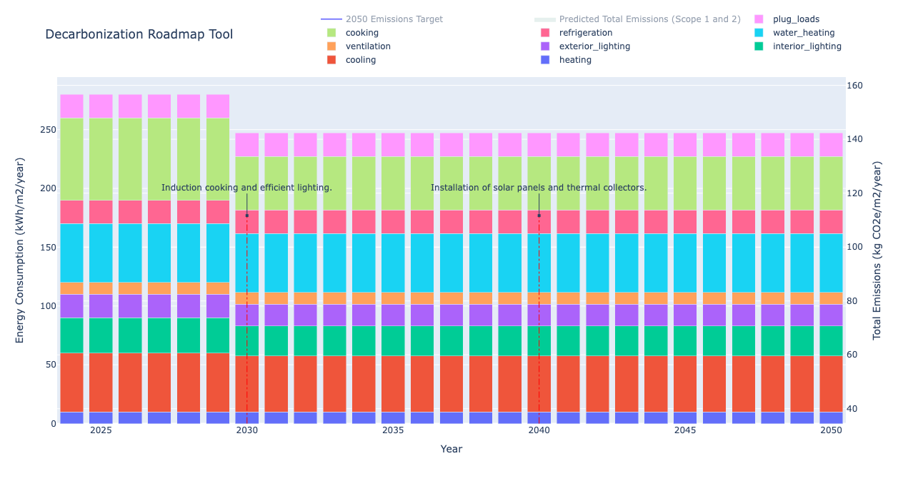

# 🌱 Decarbonization Roadmap

This is a basic but powerful Decarbonization Roadmap Tool. The goal is to predict carbon reductions from a bottom-up approach while into account uncertainties using Monte Carlo simulation. 🚀 This methodology leverages available information about energy end-use breakdowns and primary energy sources.



The tool allows you to provide two types of uncertainty:

- In the estimation of the end use itself, which can be reduced with an energy audit.
- In the prediction of the improvement, which comes from the modeling tool.

The blue area is the sum of the two uncertainties. Which allows user to understand how comfortable they are with their current uncertainty.


## Inputs 📊

The `decarbonization_info.json` file requires the following information:

### Current Conditions 🏙️

- **Year (current)**: The current year for which the energy usage data is provided.

- **End Uses**:

  - **Heating**: Energy consumed for space heating in a building.
  - **Cooling**: Energy consumed for space cooling, including air conditioning.
  - **Interior Lighting**: Energy used to illuminate the interior spaces of a building, encompassing both general lighting and task lighting.
  - **Exterior Lighting**: Energy used to illuminate exterior areas such as parking lots, walkways, and building facades.
  - **Ventilation**: Energy used for providing outdoor air ventilation to maintain indoor air quality and occupant comfort.
  - **Water Heating**: Energy used to heat water for various purposes, including domestic hot water, process water, and space heating through hydronic systems.
  - **Refrigeration**: Energy used for refrigeration systems, encompassing walk-in coolers, refrigerated display cases, and other commercial refrigeration equipment.
  - **Cooking**: Energy used for cooking appliances in commercial kitchens, such as ovens, stoves, grills, fryers, and other cooking equipment.
  - **Plug Loads**: Energy used by miscellaneous electrical equipment like computers, printers, copiers, kitchen appliances, and other plug-in devices.
  - **Process Loads**: Energy used for specific processes or equipment within a building, such as industrial machinery, manufacturing processes, or specialized equipment.

  For each end-use, provide the following:

  - **EUI (kWh/m2/year)**: The energy use intensity or energy consumption per unit area.
  - **Uncertainty**: The uncertainty associated with the EUI measurement, typically represented as the standard deviation or a percentage.
  - **Primary Energy**: The primary energy source used to fulfill the energy demand for the respective end-use (e.g., electricity, natural gas).

### Future Projections 🔮

For one or more specific years in the future:

- **Year (future)**: The year for which the projected energy reductions are provided.

- **Description**: Description of the intervention planned.

- **End Uses Reduction (kWh/m2/year)**: The energy use change in energy consumption compared to the current conditions for each end-use. Negative values indicate a reduction, while positive values indicate an increase.
- **End Uses Uncertainty (kWh/m2/year)**: The uncertainty associated with the projected energy reductions for each end-use, represented as the standard deviation.
- **End Uses Primary Energy**: The primary energy source projected to be used for each end-use in the future year(s).

Make sure to fill these details accurately in `decarbonization_info.json` for reliable projections and simulations.

## How to Use 🛠️

1. **Installation**:

   - Install Python modules required by the script:
     ```
     pip install -r requirements.txt
     ```

2. **Execution**:

   - Run the script:
     ```
     python app.py
     ```

3. **Optional Customization**:
   - Edit the `decarbonization_info.json` file to provide custom information like end-uses, primary energy sources, carbon emission factors, and predictions for end-use changes.

## Example Decarbonization Info 📋

Here's a snippet of what your `decarbonization_info.json` could look like:

```json
{
  "current_conditions": {
    "year": 2024,
    "end_uses": {
      "heating": {
        "EUI": 10.0,
        "uncertainty": 5,
        "primary_energy": "natural_gas"
      },
      "cooling": {
        "EUI": 50,
        "uncertainty": 3,
        "primary_energy": "electricity"
      },
      "interior_lighting": {
        "EUI": 30,
        "uncertainty": 2,
        "primary_energy": "electricity"
      },
      "exterior_lighting": {
        "EUI": 20,
        "uncertainty": 1,
        "primary_energy": "electricity"
      },
      "ventilation": {
        "EUI": 10,
        "uncertainty": 4,
        "primary_energy": "electricity"
      },
      "water_heating": {
        "EUI": 50,
        "uncertainty": 6,
        "primary_energy": "natural_gas"
      },
      "refrigeration": {
        "EUI": 20.0,
        "uncertainty": 8,
        "primary_energy": "refrigerants"
      },
      "cooking": {
        "EUI": 70,
        "uncertainty": 7,
        "primary_energy": "natural_gas"
      },
      "plug_loads": {
        "EUI": 20,
        "uncertainty": 9,
        "primary_energy": "electricity"
      },
      "process_loads": {
        "EUI": 0.0,
        "uncertainty": 11,
        "primary_energy": "electricity"
      }
    }
  },
  "future_years": [
    {
      "year": 2030,
      "description": "Induction cooking and efficient lighting.",
      "end_uses_reduction": {
        "heating": 0.0,
        "cooling": -5.0,
        "interior_lighting": -15.0,
        "exterior_lighting": -7.0,
        "ventilation": 0.0,
        "water_heating": 0.0,
        "refrigeration": 0.0,
        "cooking": -35,
        "plug_loads": 0.0,
        "process_loads": 0.0
      },
      "end_uses_uncertainty": {
        "heating": 1,
        "cooling": 1,
        "interior_lighting": 1,
        "exterior_lighting": 1,
        "ventilation": 1,
        "water_heating": 1.5,
        "refrigeration": 1.5,
        "cooking": 5.5,
        "plug_loads": 1,
        "process_loads": 2
      },
      "end_uses_primary_energy": {
        "heating": "natural_gas",
        "cooling": "electricity",
        "interior_lighting": "electricity",
        "exterior_lighting": "electricity",
        "ventilation": "electricity",
        "water_heating": "natural_gas",
        "refrigeration": "refrigerants",
        "cooking": "natural_gas",
        "plug_loads": "electricity",
        "process_loads": "electricity"
      }
    },
    {
      "year": 2040,
      "description": "Installation of solar panels and thermal collectors.",
      "end_uses_reduction": {
        "heating": 0.0,
        "cooling": 0.0,
        "interior_lighting": 0.0,
        "exterior_lighting": 0.0,
        "ventilation": 0.0,
        "water_heating": 0.0,
        "refrigeration": 0.0,
        "cooking": 0.0,
        "plug_loads": 0.0,
        "process_loads": 0.0
      },
      "end_uses_uncertainty": {
        "heating": 1,
        "cooling": 1,
        "interior_lighting": 1,
        "exterior_lighting": 1,
        "ventilation": 1,
        "water_heating": 1.5,
        "refrigeration": 1.5,
        "cooking": 5.5,
        "plug_loads": 1,
        "process_loads": 2
      },
      "end_uses_primary_energy": {
        "heating": "natural_gas",
        "cooling": "solar_pv",
        "interior_lighting": "solar_pv",
        "exterior_lighting": "solar_pv",
        "ventilation": "solar_pv",
        "water_heating": "solar_pv",
        "refrigeration": "refrigerants",
        "cooking": "natural_gas",
        "plug_loads": "solar_pv",
        "process_loads": "solar_pv"
      }
    }
  ]
}
```

## License 📜

This project is licensed under the terms of the MIT license. See the [LICENSE](LICENSE) file for details.

Ready to decode the future of carbon reductions? Let's dive in! 🌍💡
